# Summary of 2_DecisionTree

[<< Go back](../README.md)

## Decision Tree
- **n_jobs**: -1
- **criterion**: gini
- **max_depth**: 3
- **explain_level**: 2

## Validation
 - **validation_type**: split
 - **train_ratio**: 0.75
 - **shuffle**: True
 - **stratify**: True

## Optimized metric
logloss

## Training time

14.9 seconds

## Metric details
|           |    score |   threshold |
|:----------|---------:|------------:|
| logloss   | 0.436436 | nan         |
| auc       | 0.870434 | nan         |
| f1        | 0.825652 |   0.518668  |
| accuracy  | 0.79896  |   0.518668  |
| precision | 0.791353 |   0.518668  |
| recall    | 1        |   0.0630936 |
| mcc       | 0.592415 |   0.518668  |

## Metric details with threshold from accuracy metric
|           |    score |   threshold |
|:----------|---------:|------------:|
| logloss   | 0.436436 |  nan        |
| auc       | 0.870434 |  nan        |
| f1        | 0.825652 |    0.518668 |
| accuracy  | 0.79896  |    0.518668 |
| precision | 0.791353 |    0.518668 |
| recall    | 0.863059 |    0.518668 |
| mcc       | 0.592415 |    0.518668 |

## Confusion matrix (at threshold=0.518668)
|                  |   Predicted as long |   Predicted as short |
|:-----------------|--------------------:|---------------------:|
| Labeled as long  |                1428 |                  555 |
| Labeled as short |                 334 |                 2105 |

## Learning curves
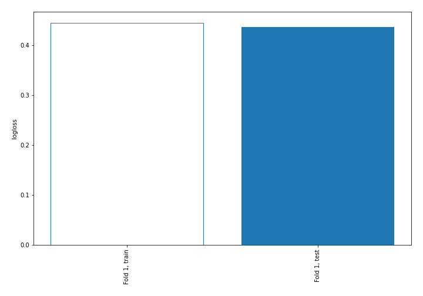

## Decision Tree 

### Tree #1
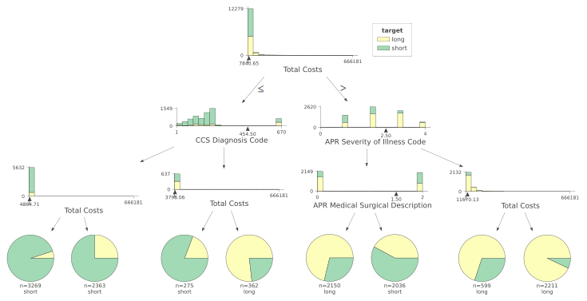

### Rules

if (Total Costs <= 7840.645) and (CCS Diagnosis Code <= 454.5) and (Total Costs <= 4864.71) then class: short (proba: 95.04%) | based on 3,269 samples

if (Total Costs <= 7840.645) and (CCS Diagnosis Code <= 454.5) and (Total Costs > 4864.71) then class: short (proba: 74.99%) | based on 2,363 samples

if (Total Costs > 7840.645) and (APR Severity of Illness Code > 2.5) and (Total Costs > 11670.13) then class: long (proba: 92.99%) | based on 2,211 samples

if (Total Costs > 7840.645) and (APR Severity of Illness Code <= 2.5) and (APR Medical Surgical Description <= 1.5) then class: long (proba: 71.26%) | based on 2,150 samples

if (Total Costs > 7840.645) and (APR Severity of Illness Code <= 2.5) and (APR Medical Surgical Description > 1.5) then class: short (proba: 57.91%) | based on 2,036 samples

if (Total Costs > 7840.645) and (APR Severity of Illness Code > 2.5) and (Total Costs <= 11670.13) then class: long (proba: 69.95%) | based on 599 samples

if (Total Costs <= 7840.645) and (CCS Diagnosis Code > 454.5) and (Total Costs > 3798.055) then class: long (proba: 76.8%) | based on 362 samples

if (Total Costs <= 7840.645) and (CCS Diagnosis Code > 454.5) and (Total Costs <= 3798.055) then class: short (proba: 80.73%) | based on 275 samples

## Permutation-based Importance
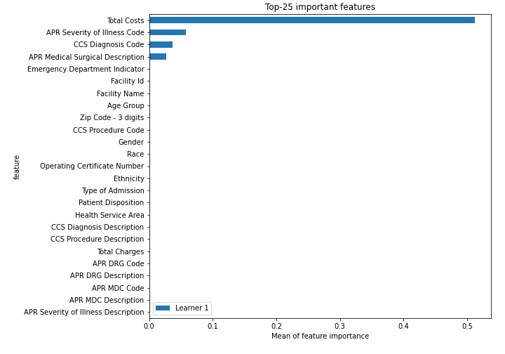
## Confusion Matrix

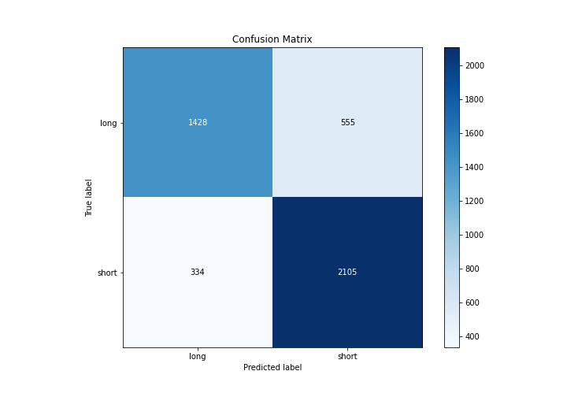

## Normalized Confusion Matrix

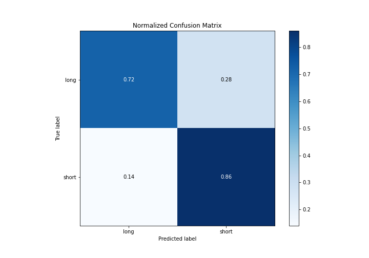

## ROC Curve

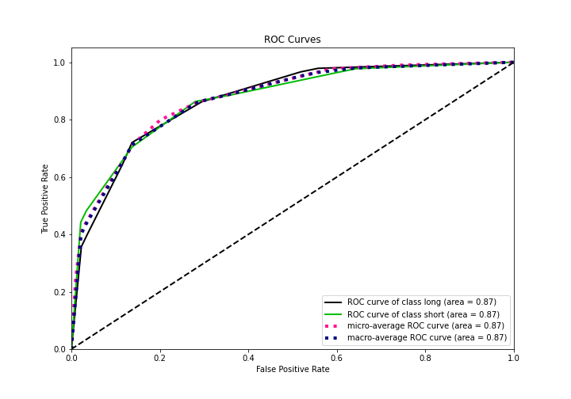

## Kolmogorov-Smirnov Statistic

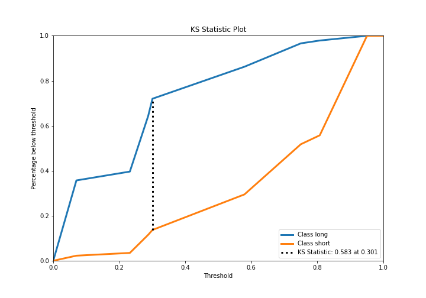

## Precision-Recall Curve

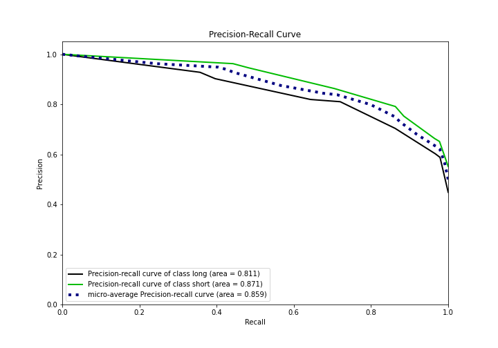

## Calibration Curve

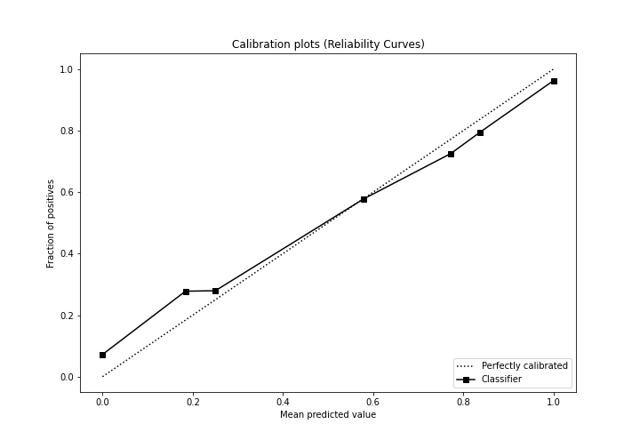

## Cumulative Gains Curve

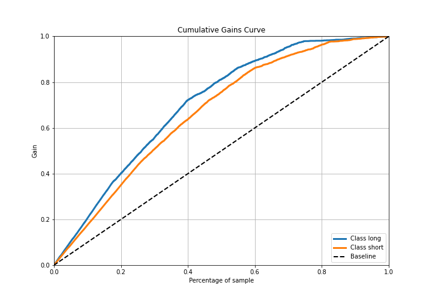

## Lift Curve

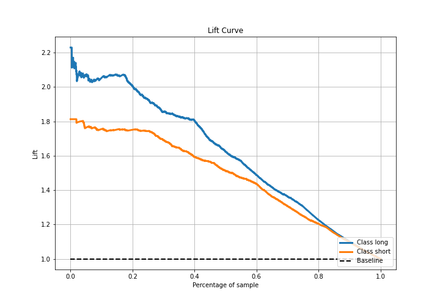

## SHAP Importance
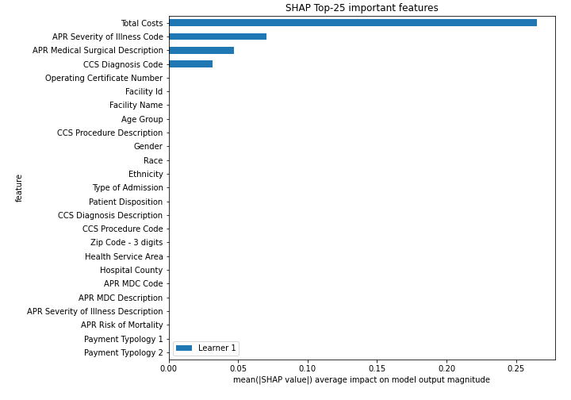

## SHAP Dependence plots

### Dependence (Fold 1)
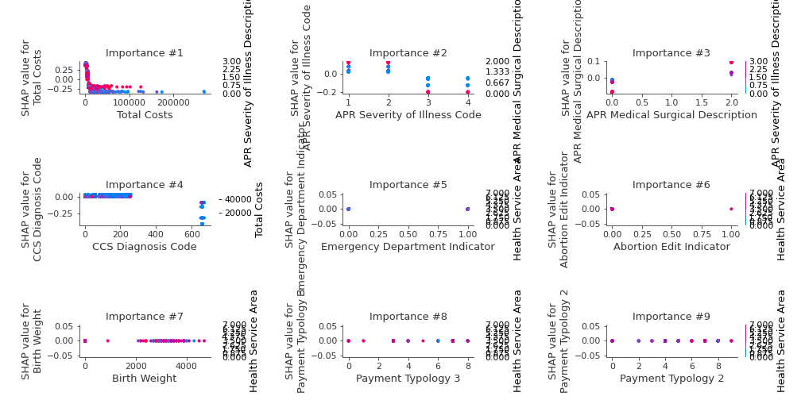

## SHAP Decision plots

### Top-10 Worst decisions for class 0 (Fold 1)
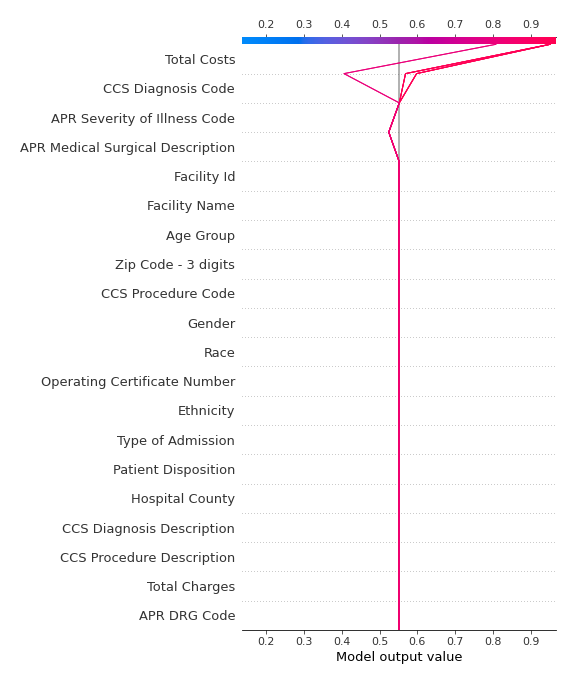
### Top-10 Best decisions for class 0 (Fold 1)

### Top-10 Worst decisions for class 1 (Fold 1)
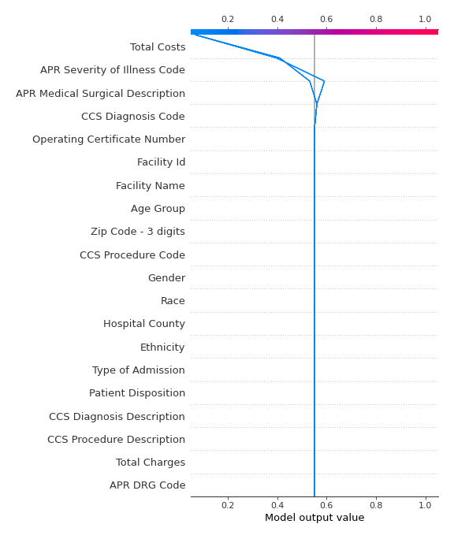
### Top-10 Best decisions for class 1 (Fold 1)
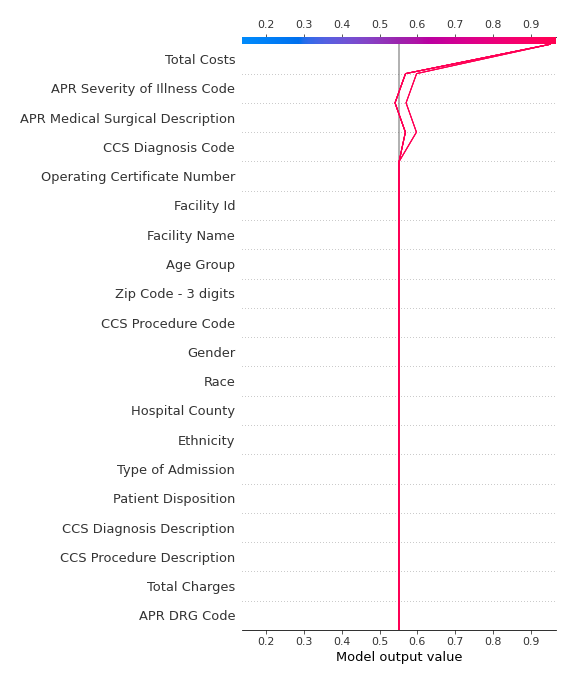

[<< Go back](../README.md)
