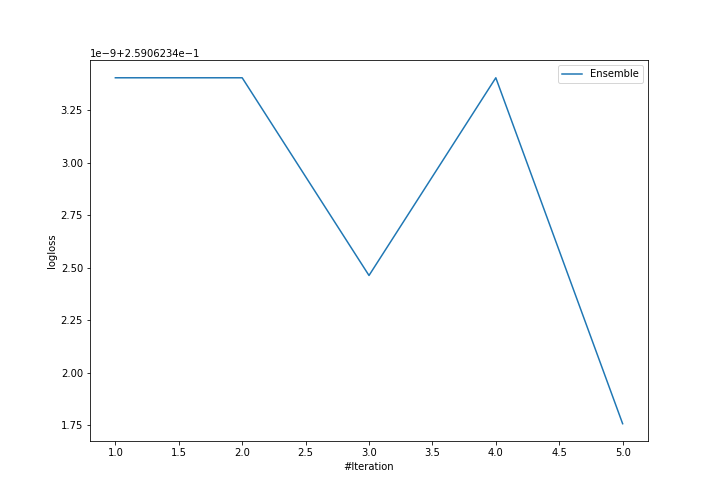
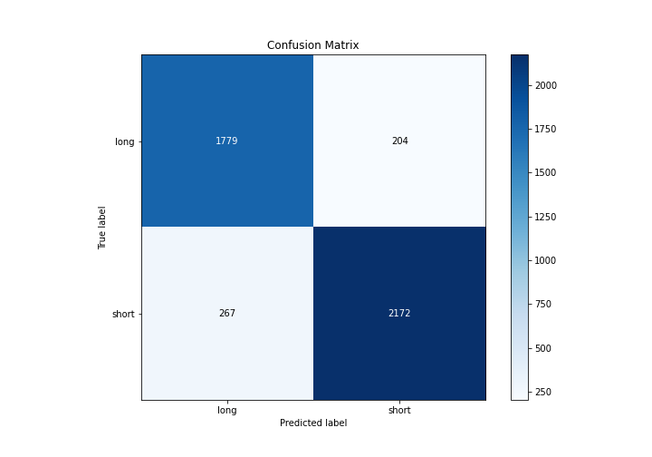
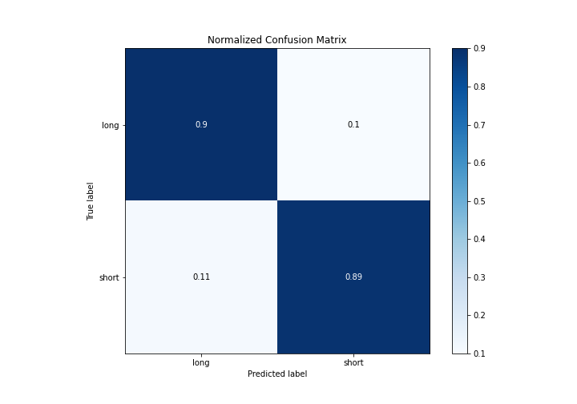
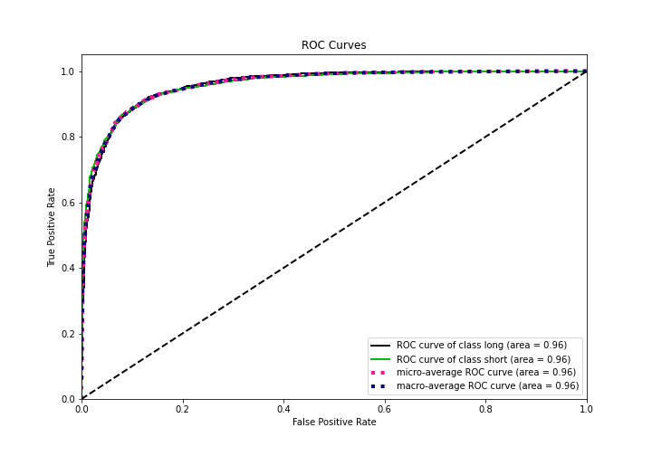
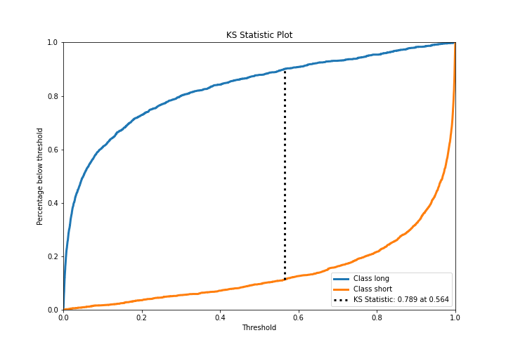
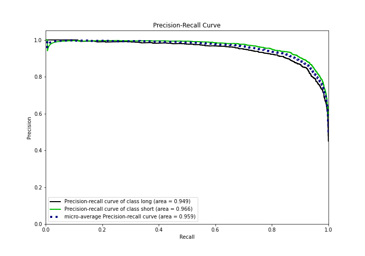
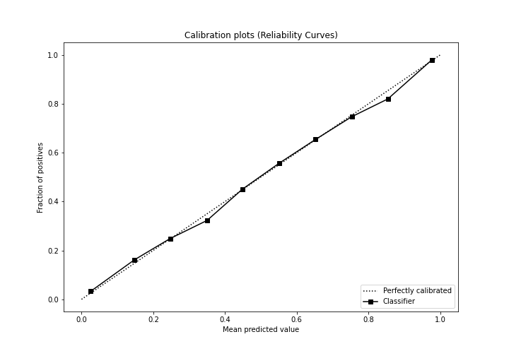
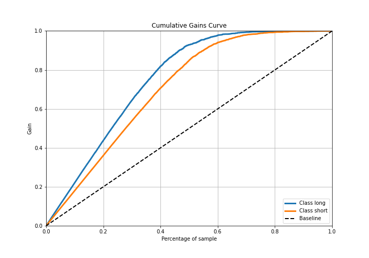
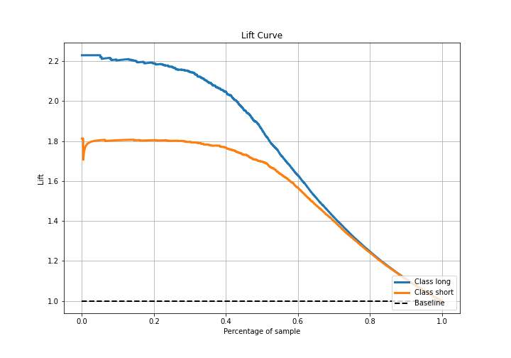

# Summary of Ensemble

[<< Go back](../README.md)

## Ensemble structure
| Model             |   Weight |
|:------------------|---------:|
| 3_Default_Xgboost |        5 |

## Metric details
|           |    score |     threshold |
|:----------|---------:|--------------:|
| logloss   | 0.259062 | nan           |
| auc       | 0.958834 | nan           |
| f1        | 0.904165 |   0.452821    |
| accuracy  | 0.893487 |   0.556852    |
| precision | 0.996491 |   0.994703    |
| recall    | 1        |   0.000147622 |
| mcc       | 0.785646 |   0.556852    |

## Metric details with threshold from accuracy metric
|           |    score |   threshold |
|:----------|---------:|------------:|
| logloss   | 0.259062 |  nan        |
| auc       | 0.958834 |  nan        |
| f1        | 0.902181 |    0.556852 |
| accuracy  | 0.893487 |    0.556852 |
| precision | 0.914141 |    0.556852 |
| recall    | 0.890529 |    0.556852 |
| mcc       | 0.785646 |    0.556852 |

## Confusion matrix (at threshold=0.556852)
|                  |   Predicted as long |   Predicted as short |
|:-----------------|--------------------:|---------------------:|
| Labeled as long  |                1779 |                  204 |
| Labeled as short |                 267 |                 2172 |

## Learning curves

## Confusion Matrix

## Normalized Confusion Matrix

## ROC Curve

## Kolmogorov-Smirnov Statistic

## Precision-Recall Curve

## Calibration Curve

## Cumulative Gains Curve

## Lift Curve

[<< Go back](../README.md)
